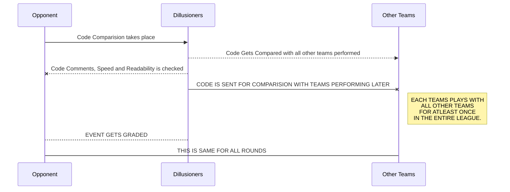

# ONPASSIVE TOURNAMENT

>**What is OnPassive?** 
>ONPASSIVE *is an AI tech company that builds tools and applications which are aimed at driving the growth rate of businesses.* ONPASSIVE *combines artificial intelligence, real-time flow analysis and machine learning to build an AI-driven business platform and communication.*


## About the tournament.

We are hosting a tournament with Mr. ****** **** to  provide you some cool prizes. We want to find the true potential in your team and encourage you to be the next generation **SuperBs**.

Our *Checking Algorithm* is satisfying $\aleph(n) = \kappa (n-1) +\forall n\in\mathbb N$ . It is elaborated by:-

$$
\aleph(z) = \int_0^1 x^{n-1}i^{-n} dt\,.
$$


## CAS Sequence

This is the main grading pattern for us:-


```
